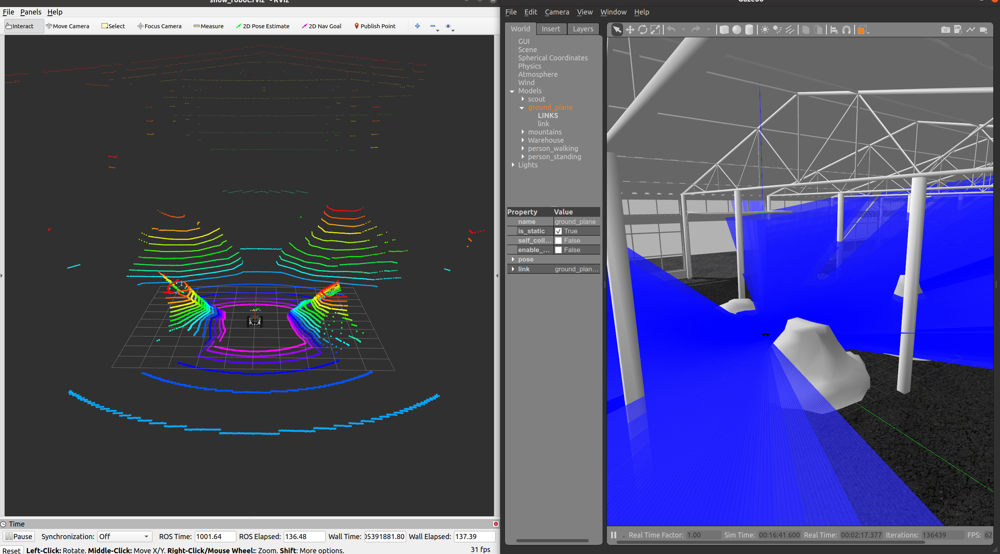
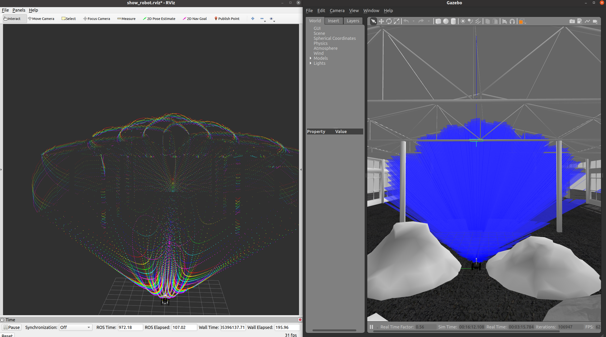
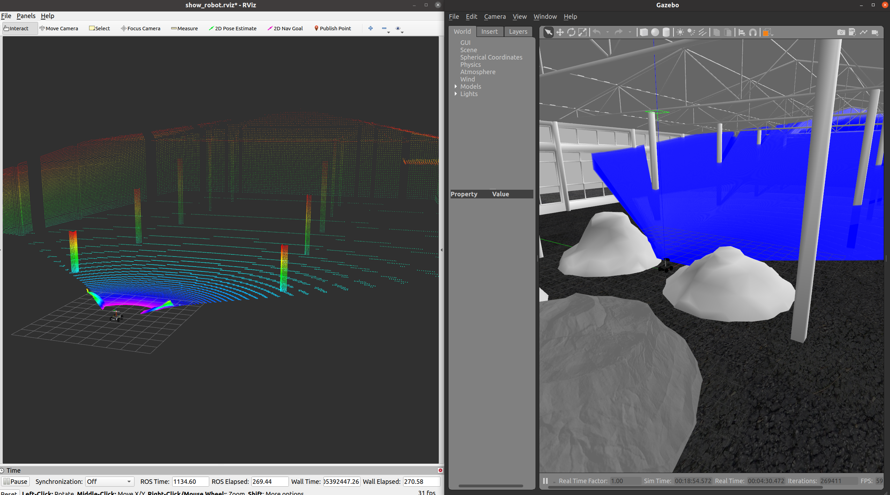

To run the simulation:
```bash
$ roslaunch scout_gazebo gazebo.launch
```
There are three kinds of lidars in the package。You can use argument `lidar_type` in `scout_gazebo/urdf/base.xacro`to choose the lidar type：:
- 0 : 360° spinning lidar

- 1 : livox lidar

- 2 : small FOV solid lidar



